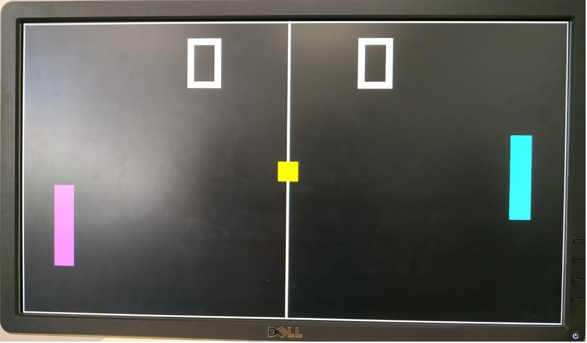
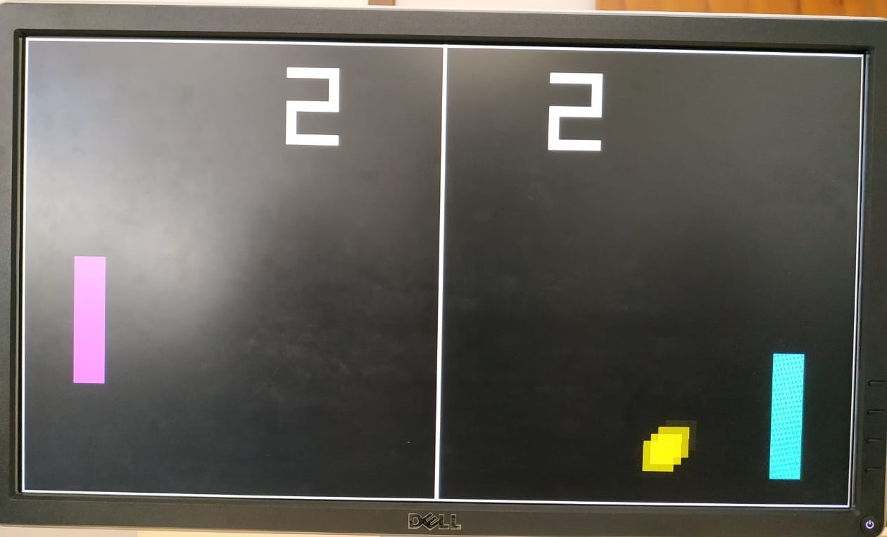
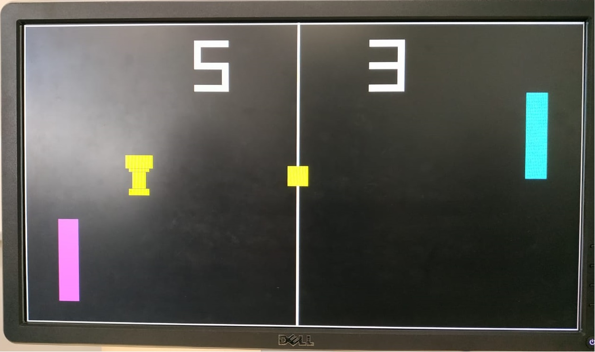
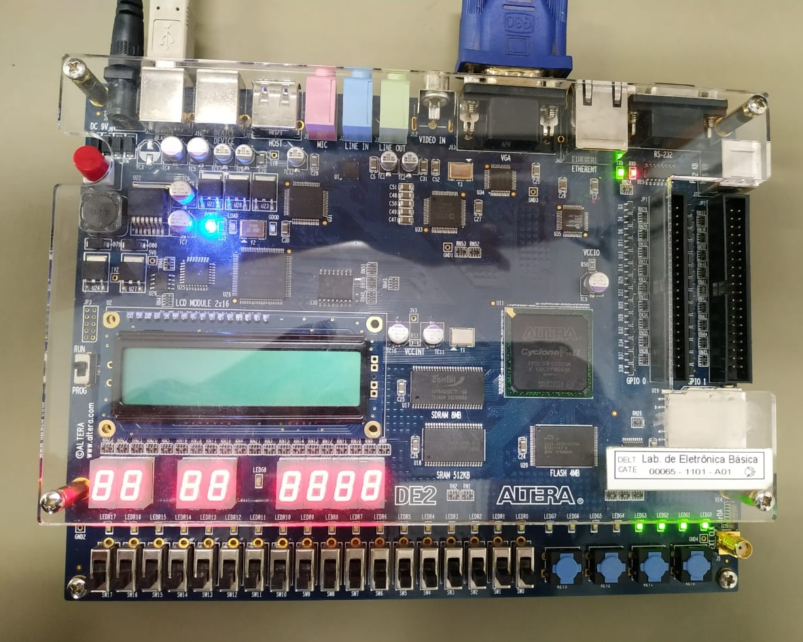

# PONG
The Classic PONG made in VHDL with the Altera DE2 Development Board using its VGA Port. It was developed as the final project of the Laboratory of Digital Systems (Laboratório de Sistemas Digitais) discipline from my Electrical Engeneering course at UFMG.

## Execution
To execute the project, it is necessary to have the Altera DE2 Board and a monitor with a VGA port (it was developed to suit well a 1600x900px monitor, but it is possible to change to another one by changing some constants in [HEADER.vhd](HEADER.vhd)). The code shall be recompiled and uploaded to the board.

The players are controlled by the 4 push buttons in the board, of which 2 buttons control the player on the left and the other 2 control control the player on the right.

The game itself works just like the [normal pong game](https://www.ponggame.org/), in this case the match ends when one of the players scores 5 points. The screens shows a little trophy and it restarts.

I left some pictures below to give a better view on the project.

  
  
    
  

## Files
The software was devoloped using Intel's Quartus II software, this repository contains all the files from the Quartus Project, but the files where the actual code is placed are the ones described below.

File                     | Overall function
---                      | ---
[VGA.vhd](VGA.vhd)       | The top level entity of the project which contains all inputs and outpus and gets functionalities from the other files.
[SYNC.vhd](SYNC.vhd)     | This file contains the entity that creates the VGA signal and calls the DRAW procedure to draw the game components.
[DRAW.vhd](DRAW.vhd)     | Responsible to draw the game components.
[GAME.vhd](GAME.vhd)     | This file holds the game logic, such as player movement, ball movement and score counting.
[HEADER.vhd](HEADER.vhd) | This file contains the constants used in almost all of the previous files, such as the size of the players, size of the screen, size of the ball, etc.

## Improvement
Even though this project was more then enough to complete the discipline, it still has much room for improvement. I'm leaving below some new functionalities that would enrich this project.
* One player mode
* Ball with increasing velocity throughout the game (right now the ball has a contant velocity, only its direction changes with the collisions)
* Better graphics
* Sound (it currently has no sound)
* Pause functionality
* Start menu

